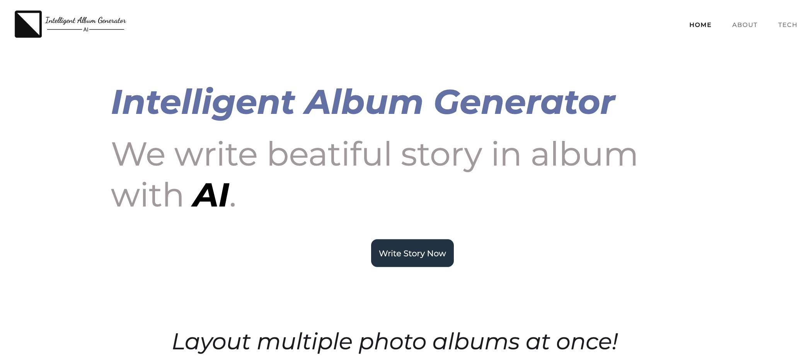

**Intelligent Album Generator**

## SECTION 1 : PROJECT TITLE
## Intelligent Album Generator

---

## SECTION 2 : EXECUTIVE SUMMARY / PAPER ABSTRACT
The Intelligent Album Generator is designed to revolutionize how we organize and cherish our memories in the digital age. It addresses the growing need for a personalized solution in creating photo albums by introducing a system that can automatically generate albums tailored to individual preferences. Users can upload photos and select preferences to create albums that resonate with their experiences and emotions.

In the fast-paced modern era, the abundance of personal photos often leads to disorganization, with many memories awaiting proper arrangement. The Intelligent Album Generator simplifies the process of sorting through extensive photo collections, offering an efficient, one-click solution for album creation. It stands apart in its ability to generate albums in formats like PDF, employing advanced AI, deep learning, and machine learning techniques. This system not only analyzes photo content for object identification and layout design but also intelligently sorts and enhances photos based on time, location, and theme. This project aligns with current trends in mobile solutions, automation, intelligence, and social media integration, allowing users to import photos directly from social platforms.

---

## SECTION 3 : CREDITS / PROJECT CONTRIBUTION

| Official Full Name  | Student ID (MTech Applicable)  | Work Items (Who Did What) | Email (Optional) |
| :------------ |:---------------:| :-----| :-----|
| XIANG YI | A0285838J |Core developer of backend, mainly genetic algorithm and album maker part. Helped with system design video and report.| e1221650@u.nus.edu |
| YAN FU | A0286045B | Proposed project themes and some novel function design suggestions after market research like automatic deletion of similar photos. Inspired by image fingerprinting techniques, I design and development of algorithms for recognition and deletion of duplicate photos, later improved to algorithms for recognition and deletion of similar photos. I wrote up the Project Proposal and took part in the PowerPoint presentation and reporting.| E1221857@u.nus.edu|
| YIN SIYUAN | A0286060H | Time management and meeting schedule as a leader for this project. Focus on system prototype development, report writing and integration.|e1221872@u.nus.edu|
| REN JIANAN | A0285879Y |Responsible for developing modern web application interfaces, implementing responsive design, and writing HTML, CSS and JavaScript codes using VS Code. On the back-end, I implemented image processing functions, including time information extraction, album background design, and enhanced the automatic recognition capabilities of content classification by calling the Place365 scene recognition model API. As a multimedia editor, I am responsible for producing promotional videos to enhance the market appeal of our web application.| E1221691@u.nus.edu|
| TANG HAORAN | A0285856J |The role encompasses participation in system hierarchy and detailed function design, with a focus on machine learning algorithm selection, such as devising innovative photo recommendation strategies. Additionally, responsibilities include Python development tasks, specifically filtering out duplicate images based on hash analysis and similarity thresholds. Furthermore, active involvement in crafting comprehensive project reports is essential, summarizing project background, characteristics, and target user groups, while critically addressing project shortcomings and proposing creative improvement plans for interested investors.
| E1221668@u.nus.edu|

---

## SECTION 4 : VIDEO OF SYSTEM MODELLING & USE CASE DEMO
Please refer to the [Video]
`<Github File Link>` : <https://github.com/stacyhaha/IRS-PM-2023-10-IS05FT-Group17-intelligent-album-generator/tree/main/Video>

---

## SECTION 5 : USER GUIDE
Please refer to the [User Guide] for detailed instructions on how to use the Intelligent Album Generator.
`<Github File Link>` : <https://github.com/stacyhaha/IRS-PM-2023-10-IS05FT-Group17-intelligent-album-generator/blob/main/UserGuide/Installation%20and%20User%20Guide.pdf>

---
## SECTION 6 : PROJECT REPORT / PAPER
Refer to the [PROJECT REPORT] for an in-depth analysis and technical details of the project.
`<Github File Link>` : <https://github.com/stacyhaha/IRS-PM-2023-10-IS05FT-Group17-intelligent-album-generator/blob/main/ProjectReport/ISY5001_Report_Group17.pdf>

---
## SECTION 7 : MISCELLANEOUS
cover.png